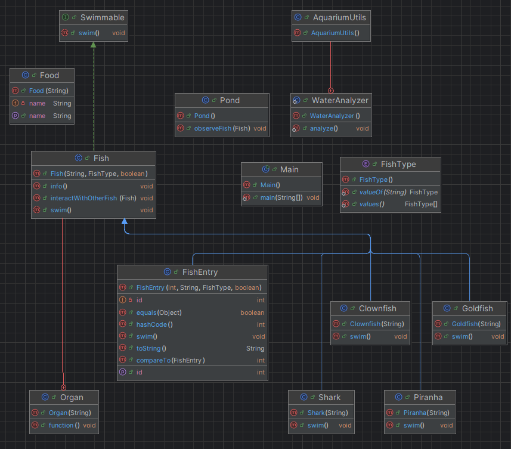

##Завдання

Реалізувати прикладну програму, яка демонструє використання стандартних колекцій Java для роботи з об'єктами. Для цього:

1. Взяти за основу класи, створені у Лабораторній роботі №4 (наприклад, класи про риб).
2. Створити екземпляри класів (з кількома дублікатами).
3. Провести наступні операції з колекціями:

---

1. ✅ **ArrayList** — додати всі елементи (включно з дублікатами).
2. ✅ **HashSet** — додати ті ж елементи, щоб перевірити унікальність на основі `equals()` та `hashCode()`.
3. ✅ **Collections.sort()** — відсортувати список з п.1 за певним критерієм (`Comparable`).
4. ✅ **TreeSet** — зберегти унікальні та відсортовані об'єкти.
5. ✅ **TreeMap** — створити відображення `Map<id, об'єкт>`, де ключ — унікальна ознака (наприклад, `id`).
6. ✅ **LinkedList** — додати ті ж елементи (дублікати дозволено).
7. ✅ **Queue (LinkedList)** — показати принцип FIFO (перший увійшов — перший вийшов).
8. ✅ **PriorityQueue** — додати елементи з автоматичним сортуванням за критерієм `compareTo()`.

---

## Результати роботи програми

🔹 **ArrayList** — зберігає всі елементи, включно з дублікатами.  
🔹 **HashSet** — прибирає дублікати (за `id`).  
🔹 **Sorted ArrayList** — сортує елементи за ім’ям.  
🔹 **TreeSet** — зберігає лише унікальні, автоматично сортує за іменем.  
🔹 **TreeMap** — дозволяє працювати з парами `ключ–значення`, перезаписує елементи з однаковим `id`.  
🔹 **LinkedList** — підтримує порядок вставки.  
🔹 **Queue** — демонструє принцип черги (FIFO).  
🔹 **PriorityQueue** — автоматично сортує при вставці.

---

