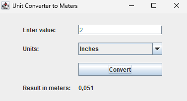

#  Конвертер одиниць (Дюйми, Фути, Милі → Метри)

##  Мета програми

Реалізувати графічну програму на Java (Swing), яка дозволяє переводити значення з імперських одиниць (дюйми, фути, милі) в метричну систему (метри), з урахуванням локалізованого формату чисел.

---

## Інтерфейс

---

##  Формули переведення

- 1 дюйм = **0.0254** метра
- 1 фут = **0.3048** метра
- 1 миля = **1609.344** метра

