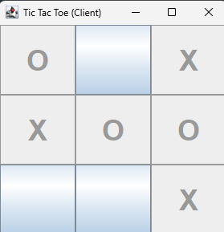

# Tic-Tac-Toe Network Game (Хрестики-Нулики по Мережі)

## Опис проєкту

Ця мережна гра "Хрестики-Нулики" реалізована на Java із використанням сокетів.  
Гравець (клієнт) грає проти комп'ютерного опонента (сервер), який має простий штучний інтелект.

---

## Особливості

- Сервер приймає підключення від клієнта.
- Сервер зберігає логіку гри та стан дошки.
- Клієнт відображає графічний інтерфейс із кнопками (Swing).
- Сервер "машина" робить ходи:
    - Пробує виграти, якщо є можливість.
    - Блокує гравця, якщо той може виграти.
    - Вибирає центр, кути або вільну клітинку у порядку пріоритету.
- Клієнт отримує оновлення стану гри після кожного ходу.

---

## Запуск

1. Запустіть сервер:
    ```bash
    java TicTacToeServer
    ```
2. Запустіть клієнта (в окремому вікні або терміналі):
    ```bash
    java TicTacToeClient
    ```
3. Грайте, клікаючи на вільні клітинки.

---

## Використані технології

- Java SE
- Swing (для GUI клієнта)
- Java Sockets (для мережевої взаємодії)

---

## Інтерфейс




